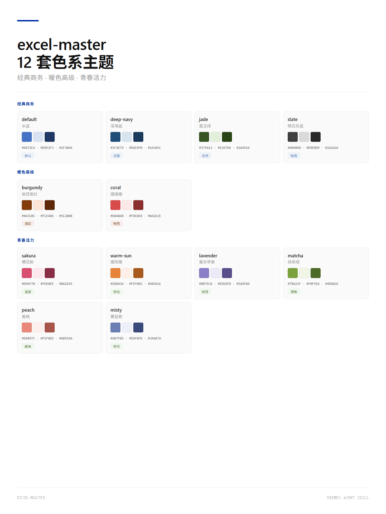

# excel-master

一份 CSV、一个乱糟糟的 Excel，一键变成**专业金融机构风格的报表**。

基于《为什么精英都是Excel控》的格式规范，用纯 openpyxl 实现，无需 Excel 外部进程（零 xlwings）。生成的结果：Arial 11、千分位、水蓝表头、上下粗线/中间虚线无竖线、B2 起始、隐藏网格线——一眼就是"拿来给老板看"的样子。

**两种模式：**

- `make_excel` — 从 DataFrame / CSV **从零生成**报表
- `beautify` — 美化**已有** Excel，**只改格式不改数据**，保留公式和值，自动备份

<p align="center">
  
</p>

---

## 安装

```bash
pip install pandas openpyxl>=3.0
```

## 快速上手

### 方式一：命令行

```bash
# 从 CSV 生成
python scripts/make_excel.py 数据.csv 输出.xlsx

# 美化已有文件（只改格式，保留公式）
python scripts/make_excel.py --beautify 已有报表.xlsx 美化后.xlsx

# 指定配色 + 冻结表头
python scripts/make_excel.py --beautify 报表.xlsx 美化后.xlsx --theme coral --freeze-rows 3
```

### 方式二：Python

```python
from make_excel import make_excel, beautify
import pandas as pd

# 从零生成
df = pd.read_csv('data.csv')
make_excel(df, '报表.xlsx')

# 多 sheet
make_excel([('汇总', df_summary), ('明细', df_detail)], '报表.xlsx')

# 切换主题
make_excel(df, '报表-深海蓝.xlsx', theme='deep-navy')

# 美化已有文件（保留公式，原地覆盖自动备份）
beautify('已有报表.xlsx')

# 美化 + 指定列类型
beautify('订单表.xlsx', col_types={'订单号': 'text', '金额': 'money'})
```

## 核心特性

### 色系主题（12 套）

| 主题名 | 中文 | 表头色 | 分类 |
|--------|------|--------|------|
| `default` | 水蓝 | #4472C4 | 经典商务 |
| `deep-navy` | 深海蓝 | #1F4E79 | 经典商务 |
| `jade` | 墨玉绿 | #375623 | 经典商务 |
| `slate` | 陨石灰蓝 | #404040 | 经典商务 |
| `burgundy` | 勃艮第红 | #843C0C | 暖色高级 |
| `coral` | 珊瑚橙 | #D84B4B | 暖色高级 |
| `sakura` | 樱花粉 | #D94F70 | 青春活力 |
| `warm-sun` | 暖阳橙 | #E8843A | 青春活力 |
| `lavender` | 薰衣草紫 | #8B7EC8 | 青春活力 |
| `matcha` | 抹茶绿 | #7BA23F | 青春活力 |
| `peach` | 蜜桃 | #E8897C | 青春活力 |
| `misty` | 雾蓝紫 | #6B7FB5 | 青春活力 |

### 智能类型推断

自动识别每列类型，套用对应的数字格式。**核心原则：百分比只看列名关键词**，值分析阶段所有小数先判为金额——防止把"0.84万元"误判成"84%"。

优先级：**pct > date > text > money**，包含防误匹配（如"毛利率"→百分比、"汇率/利率"→数字）。

误判时用 `col_types={'列名': '类型'}` 强制覆盖。

```python
beautify('订单表.xlsx', col_types={'订单号': 'text', '金额': 'money'})
```

### 多 sheet 列类型隔离

同名列在不同 sheet 语义可能不同（Sheet1 的"金额"是钱、Sheet2 的"金额"是文本编码）。用 `col_types_by_sheet` 按工作表隔离：

```python
beautify('多表.xlsx', col_types_by_sheet={'明细': {'金额': 'money'}, '汇总': {'金额': 'text'}})
```

### 条件格式自适应（需显式开启）

自带的 colorScale 色阶往往有语义（"越高越绿=好"），因此**默认不改动**。仅当明确要求配色统一时开启：

```python
# 把色阶最大色改成当前主题色（数据区内）
beautify('报表.xlsx', color_scale='apply', color_scale_scope='data')
```

`color_scale`：`auto`（默认，保留语义色）/ `apply`（改主题色）/ `off`（跳过）
`color_scale_scope`：`data`（只改数据区）/ `all`（整表）

### 其他特性

- **公式颜色区分** — 公式→黑色，手动输入值→蓝色（摩根系标准）
- **可配置表头冻结** — 参数指定 / 自动检测 / B2 起始 / 默认首行，4 种策略
- **自定义数字格式** — `fmt_override` 覆盖默认格式（如 `#,##0.0`）
- **自动备份** — 原地美化前自动备份，失败可回退
- **一次保存** — 纯 openpyxl 线性流程，格式始终完整（不用 xlwings 的三步修补循环）

## 参数速查

### `make_excel(data, output_path, ...)`

| 参数 | 说明 |
|------|------|
| `data` | DataFrame 或 `[(sheet名, df), ...]` |
| `output_path` | 输出文件路径 |
| `theme` | 主题名（见上表），默认 `default` |
| `fmt_override` | 自定义数字格式，如 `{'money': '#,##0'}` |
| `freeze_rows` | 冻结表头行数，默认自动推断 |

### `beautify(input_path, output_path=None, ...)`

| 参数 | 说明 |
|------|------|
| `input_path` / `output_path` | 输入/输出路径；不传 `output_path` 则原地覆盖 |
| `col_types` | 按列名覆盖列类型 |
| `col_types_by_sheet` | 按工作表隔离列类型 |
| `backup` | 原地覆盖前是否备份（默认 `True`） |
| `theme` | 主题名 |
| `fmt_override` | 自定义数字格式 |
| `freeze_rows` | 冻结行数 |
| `color_scale` | 条件格式色阶策略：`auto`/`apply`/`off` |
| `color_scale_scope` | 色阶应用范围：`data`/`all` |

## 设计原则

1. **零 xlwings** — 纯 openpyxl，一次保存，不调 Excel 外部进程（xlwings 会吞掉 openpyxl 的边框/颜色/数字格式）
2. **纯函数式** — 同样的输入永远产生同样的输出
3. **单文件** — `make_excel.py` 一个文件解决所有，加功能用追加函数
4. **基座职责分离** — 配色/行为作为参数暴露，上层脚本直接传参调用

## 文档结构

- `scripts/make_excel.py` — 核心脚本（生成 + 美化）
- `scripts/interactive_make_excel.py` — agent 交互层 wrapper
- `SKILL.md` — 完整的 skill 交互规范（强制约束、失败恢复表、反例黑名单）
- `references/type-inference-rules.md` — 列类型推断规则
- `references/implementation-checklist.md` — 交付前逐项验证清单
- `references/dual-header-format.py` — 双表头/多数据块布局手工脚本
- `references/camera-screenshot-white-bg.md` — Excel 截图白底修正方案
- `test-prompts.json` — 类型推断/美化/万元单位的测试用例

## License

MIT
